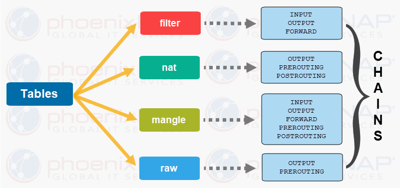

# This repo is about iptables
* Netfilter is a packet filtering inside a linux kernel
* Netfilter and iptables are often combind with single expression netfilter/iptables
* iptables belongs to user-space used to configure Netfilter


iptables use tables to organize its rules.\
 wihtin each tables, rules are further organize  with in seprate chains. \
 rules are placed with in a specific chain of a specific table.
 
 
## iptables chain

* INPUT ----> use for filter incoming packets. our host is destination.
* OUTPUT ----> used for filter outgoing packets, our host is source

* FORWARD ---> used for filter route packet, our host is a router 
* PREROUTING --->  use for DNAT (Port forwarding)

* POSTROUTING ---> use for SNAT (Masquerade)


# Netfilter Tables
* filter
* nat
* mangle
* raw

## filter table:
filter is the default table in iptables, which means, if we add a rule in iptables and don't specifiy the table, the rule add to filter table, because this table is default in iptables.

filter table has three chain: INPUT, OUTPUT, FORWARD


## nat tables:
nat table use for port forwarding.

nat table has three chain PREROUTING, POSTROUTING, OUTPUT

## mangle table:
used for packet alteration.
mangle table has all 5 build-in chain.

## raw table:
used for stateful firewall




# iptables-command

```
iptables -L             # list rules in filter table
iptables -t mangle -L   # list rules in mangle table

iptables -nvL           # list rules with packets details
iptables -t filter -A INPUT -p icmp --icmp-type echo-request -j DROP

iptables -t filter -A OUTPUT -p tcp --dport 80 -d www.google.com -j DROP


##### rule on 22 port for securing ssh

iptables -t filter -A INPUT -p tcp --dport 22 -s 172.16.2.166 -j ACCEPT
iptables -t filter -A INPUT -p tcp --dport 22 -j DROP

#####

iptables -I INPUT 3 -p tcp --dport 80 -j DROP


# flush a specific chain of table
iptables -t filter -F INPUT
iptables -t mangle -F

iptables -Z             # reset byte and counters

iptables -N custom-chain        # Create Custom chain
iptables -X custom-chain        # delete chain
```


# default policy
Policy can be changed only for INPUT, OUTPUT, FORWARD chains

```
iptables -nvL               # attention to policy

iptables -P INPUT DROP      # set default policy to DROP in INPUT chain, be careful maybe your connection will be losed.
iptables -P INPUT ACCEPT 

```

# iptables-save
iptables rules are stored in memory, so they are not persistent, because when the system is shutting down all rules will be deleted.
```

# first option
iptables-save > rules
iptables-restore rules

# second option
sudo apt install iptables-persistent
iptables-save > /etc/iptables/rules.v4


```